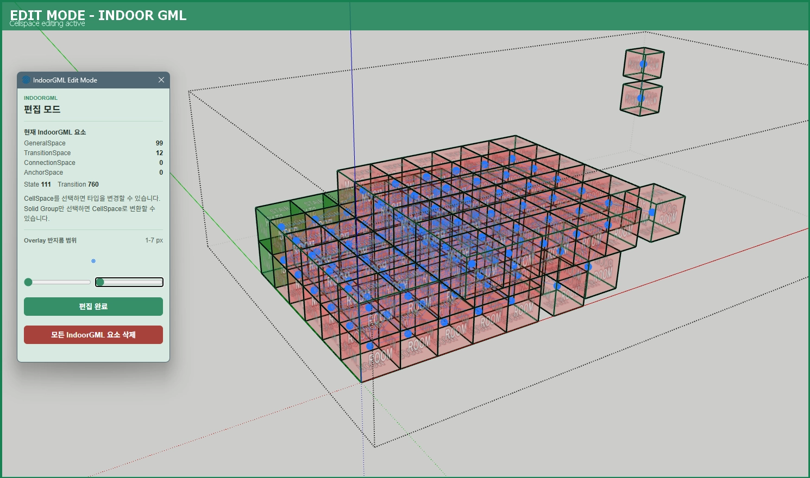
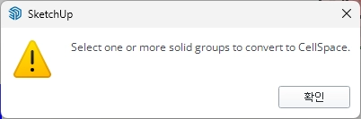
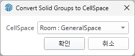
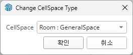
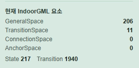
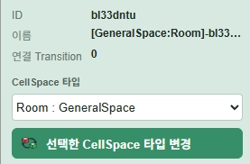

# IndoorGML 3D Modeler

> SketchUp 2026용 IndoorGML 1.0.3 모델링 및 Export Ruby Extension
> CellSpace 생성·편집·내보내기, val3dity 유효성 검증을 지원합니다.




---

## 목차

- [개요](#개요)
- [왜 만들었나요?](#왜-만들었나요)
- [설치](#설치)
- [사용 방법](#사용-방법)
- [기능 목록](#기능-목록)
- [IndoorGML 1.0.3 구현 범위](#indoorgml-103-구현-범위)
- [레거시 대비 개선 사항](#레거시-대비-개선-사항)
- [아키텍처](#아키텍처)
- [알려진 제한 사항](#알려진-제한-사항)
- [참고](#참고)

---

## 개요

| 항목          | 내용                        |
| ------------- | --------------------------- |
| 대상 플랫폼   | SketchUp 2026               |
| 준거 표준     | IndoorGML 1.0.3             |
| 배포 방식     | SketchUp Extension (`.rbz`) |
| 유효성 검증기 | val3dity v2.2.0             |
| 네임스페이스  | `ULOL::Indoor3DGmlModeler`  |

---

## 왜 만들었나요?

기존 오픈소스 익스텐션([une-young/indoorgml-modeler](https://github.com/une-young/indoorgml-modeler))을 기반으로 작업을 시작했으나, 구조적 한계로 인해 처음부터 재작성함.

**기존 익스텐션의 주요 문제점**

- **저장/불러오기 불가** — SketchUp 세션에서만 유효한 runtime 데이터가 저장 후 다시 열면 복구되지 않음
- **CellSpace 중복 State 생성** — 같은 CellSpace에서 `Create CellSpace`를 반복 실행하면 State가 계속 중복 생성됨
- **Transition이 보조선(cline)으로 생성** — SketchUp의 보조선 지우기 기능으로 Transition이 일괄 삭제되어 시각화 데이터가 사라짐
- **IndoorCreator.exe 의존** — 외부 실행 파일(`indoorCreator.exe`)을 통해 GML을 생성하는 구조로, 내부 로직을 알 수 없어 표준 준수 여부를 확인할 수 없음
- **기타 시각화 부족 및 각종 버그**

---

## 설치

**방법 1 — rbz 설치 (권장)**

1. [Releases](https://github.com/UlolSkpProject/IndoorGML_3DSpace_Modeler/releases) 페이지에서 `IndoorGML_3D_Modeler-x.x.x.rbz` 다운로드
2. SketchUp → 확장 프로그램 관리자 → 확장 프로그램 설치 → `.rbz` 선택
3. SketchUp 재시작

**방법 2 — 파일 직접 복사 (개발·테스트용)**

```
%APPDATA%\SketchUp\SketchUp 2026\SketchUp\Plugins\
├── indoor3d.rb
└── indoor3d\
```

> **Note** ULOL Extension Manager를 사용하는 경우 Manager UI에서 직접 설치·업데이트 가능.

---

## 사용 방법

### 기본 사용 흐름

**1. Solid Group 준비**

SketchUp에서 manifold(solid) 조건을 만족하는 group을 모델링합니다.
Solid가 아닌 group은 CellSpace로 변환되지 않습니다.



---

**2. Create CellSpace**

변환할 solid group을 선택하고  `Create CellSpace` 버튼을 클릭합니다.

CellSpace 타입(`Room`, `Door`, `Elevator`, `Stair`)을 함께 선택할 수 있습니다.
변환된 CellSpace는 자동으로 `IndoorGML_PrimalSpaceFeatures` 그룹(이하 PrimalGroup) 안으로 이동됩니다.



---

**3. Edit Mode 진입**

 `Edit CellSpace Property` 버튼으로 EditMode에 진입합니다.

EditMode에 진입하지 않으면 CellSpace를 이동하거나 타입을 변경할 수 없습니다.
진입 시 viewport에 2D Overlay(테두리 + 배너)가 표시됩니다.


---

**4. CellSpace 편집**

EditMode에서 CellSpace를 이동하거나,  `Change CellSpace Type` 버튼으로 타입을 변경합니다.

인접한 CellSpace 사이에는 Transition이 자동으로 생성됩니다.



---

**5. 편집 Dialog 활용**

EditMode 진입 시 표시되는 편집 Dialog에서 다음 작업을 수행할 수 있습니다.

| 기능                                                | 화면                                                     |
| --------------------------------------------------- | -------------------------------------------------------- |
| 현재 IndoorGML 요소 요약 확인                       |            |
| 선택한 CellSpace 정보 및 타입 변경                  |     |
| State/Transition 노드 Screen Space 반지름 범위 조절 |  |
| 모든 IndoorGML 요소 일괄 삭제                       |          |

---

**6. Overlay 확인**

 `State/Transition Overlay` 버튼으로 Dual Graph를 3D Overlay로 시각화합니다.

EditMode에서는 항상 ON 상태입니다.

---

**7. Check Validity & Export**

 `Check Validity` 버튼을 클릭하면 val3dity v2.2.0으로 유효성 검사를 수행하고, 통과 시 `.gml` 파일로 내보낼 수 있습니다.

유효성 검사 없이 바로 내보내려면  `Export GML`을 사용합니다.

> **⚠️ 주의** 모든 CellSpace는 반드시 PrimalGroup 내에 위치해야 합니다. 익스텐션이 로드되지 않은 상태에서 PrimalGroup 또는 CellSpace를 직접 조작하면 이후 정상 동작이 보장되지 않습니다.

---

## 기능 목록


| 버튼                                                   | 기능                     | 설명                                                       |
| ------------------------------------------------------ | ------------------------ | ---------------------------------------------------------- |
|         | Create CellSpace         | 선택한 solid group을 CellSpace로 변환                      |
|  | Edit CellSpace Property  | EditMode 진입 후 CellSpace 타입·카테고리 변경              |
|    | Change CellSpace Type    | 선택한 CellSpace 타입 변경                                 |
|      | State/Transition Overlay | 3D Overlay로 Dual Graph 시각화                             |
|               | Export GML               | IndoorGML 1.0.3 형식으로 `.gml` 파일 저장 (유효성 검사 없음) |
|           | Check Validity           | val3dity v2.2.0으로 GML 유효성 검사 후 Export              |
| 💾                                                     | Save/Load                | SketchUp 파일(`.skp`)에 attribute 내장 자동 저장 및 복원   |
| —                                                      | 다중 모델 지원           | 열린 모델별 IndoorModel 인스턴스 독립 관리                 |

---

## IndoorGML 1.0.3 구현 범위

### 구현됨

| 요소                  | 설명                                                 |
| --------------------- | ---------------------------------------------------- |
| `PrimalSpaceFeatures` | CellSpace 컨테이너                                   |
| `CellSpace`           | `GeneralSpace`, `TransitionSpace`, `ConnectionSpace` |
| `MultiLayeredGraph`   | Dual Graph 컨테이너                                  |
| `SpaceLayer`          | Export 시 단일 고정 레이어(`IS1`) 생성               |
| `State`               | Dual Graph 노드 — CellSpace와 1:1 대응               |
| `Transition`          | Dual Graph 엣지 — 인접 State 간 연결                 |

### Export XML 구조

현재 Exporter는 `3D CellSpace + 단일 SpaceLayer + State/Transition dual graph` 범위를 대상으로 IndoorGML 1.0.3 Core/Navigation XML을 생성합니다.

- `core:IndoorFeatures` 아래에 `core:primalSpaceFeatures`, `core:multiLayeredGraph`를 생성
- `core:PrimalSpaceFeatures` 안에 CellSpace를 `navi:GeneralSpace`, `navi:TransitionSpace`, `navi:ConnectionSpace`로 출력
- 모든 `navi:*Space`에 Navigation XSD 필수 요소인 `navi:class`, `navi:function`, `navi:usage`를 출력
- `core:MultiLayeredGraph` 안에 단일 `core:SpaceLayer`(`IS1`)와 `core:nodes`, `core:edges`를 생성
- `core:State`는 `core:duality`, `core:connects`, `core:geometry`를 출력
- `core:Transition`은 `core:weight`를 `1`로 출력하고, 정확히 2개의 `core:connects`와 `core:geometry`를 출력
- export 가능한 CellSpace가 없으면 빈 `core:nodes` 구조를 만들지 않고 export를 중단

### 미구현

| 요소                | 비고                                           |
| ------------------- | ---------------------------------------------- |
| `AnchorSpace`       | 타입 상수만 정의, UI에서 선택 불가             |
| 다중 `SpaceLayer`   | 현재는 단일 고정 레이어(`IS1`)만 생성          |
| `CellSpaceBoundary` | 최소 구현 방침에 따라 생략                     |
| `NavigableBoundary` | `CellSpaceBoundary` 생략 정책에 따라 미출력    |
| `InterLayerConnection` | 다중 레이어 미지원으로 미출력               |
| `Route`/`RouteNode`/`RouteSegment` | 경로 탐색 결과 모델 미지원       |
| POI                 | application-specific 기능, 향후 extension 후보 |
| AnchorNode          | application-specific 기능, 향후 extension 후보 |

---

## 레거시 대비 개선 사항

### 💾 저장/불러오기

IndoorGML 데이터를 attribute dictionary 형태로 CellSpace entity에 기록하여 `.skp` 파일에 내장 저장함.
파일을 다시 열면 `RuntimeRestorer`가 저장된 attribute를 읽어 CellSpace와 State를 복원하고, Transition은 adjacency 재계산을 통해 재생성함.

### 🔁 중복 State 생성 방지

`CellSpace`와 `State`를 1:1 duality 관계로 강제 관리함.
이미 CellSpace로 변환된 group은 재변환이 차단되어(`converted_group?` 검사), 동일한 group에서 반복 실행해도 중복 변환이 발생하지 않음.

### 🎨 3D Overlay 시각화

State와 Transition을 SketchUp geometry(cline, edge 등)로 만들지 않고, SketchUp 2026의 **3D Overlay API**를 사용하여 렌더링함.
SketchUp 일반 편집 명령(보조선 삭제 등)의 영향을 받지 않음.

SketchUp Ruby API의 `view.draw()` 메서드에는 instancing 파라미터가 없으므로, 모든 State circle의 triangle geometry를 하나의 배열로 합쳐 `view.draw(GL_TRIANGLES, points)` 단일 호출로 처리하는 **geometry batching** 방식으로 draw call을 최소화함.

State와 Transition 노드의 크기는 절대 단위(model space)가 아닌 **Screen Space 기준**으로 결정됨.
`view.pixels_to_model()`을 사용하여 pixel 반지름을 현재 카메라 거리에 맞는 model 단위로 변환하고, 설정된 min/max 범위 안으로 clamp함.
줌 레벨이나 공간 스케일에 관계없이 State/Transition 노드가 항상 일정한 가시성을 유지함.


### 🔒 EditMode 보호

모든 IndoorGML 요소(PrimalSpaceFeatures group 등)를 기본적으로 **lock** 상태로 유지하여, SketchUp 일반 편집 동작으로 IndoorGML 구조가 의도치 않게 수정·삭제되는 것을 방지함.
EditMode 진입 여부는 **2D Overlay**로 viewport에 표시함(테두리 + 배너).
CellSpace 자체는 EditMode에서 이동·편집이 가능하도록 unlock 상태로 유지되며, **Observer 패턴**으로 변경사항을 감지하여 IndoorGML 데이터에 반영함.

### ⚡ Adjacency 판별 최적화

| 항목        | `une-young/indoorgml-modeler` | `UlolSkpProject/IndoorGML_3DSpace_Modeler` |
| ----------- | ----------------------------- | ------------------------------------------ |
| 테스트 Grid | 6×6×3                         | 6×6×3                                      |
| 처리 시간   | **194초**                     | **17초**                                   |
| 성능 향상   | —                             | **약 11.4배**                              |

> 비교 시 유의사항: 레거시는 CellSpace 추가 시마다 전체 adjacency를 재계산하는 방식으로 추정됨. 이 익스텐션은 추가된 CellSpace 기준으로만 인접 검사를 수행하며(`synchronize_for`), 전체 갱신이 필요한 경우에는 **dirty queue**를 통해 최적화함.

최적화 방법:

- bounding box 사전 필터로 후보 pair를 먼저 추려냄
- face-level 정밀 adjacency 검사
- 20,000쌍 이상일 경우 멀티스레드 병렬 처리 (`MAX_WORKERS = 4`)

### 📄 GML 직접 생성 (표준 준수)

레거시의 `indoorCreator.exe` 대신, Ruby로 직접 IndoorGML 1.0.3 스펙에 맞는 `.gml` 파일을 생성함.
val3dity 및 InViewer 테스트에서 문제 없음을 확인함.

Export 좌표는 현재 SketchUp 모델의 길이 단위 설정에 맞춰 변환합니다. SketchUp 내부 좌표는 inch이지만, GML에는 모델 단위(`in`, `ft`, `mm`, `cm`, `m`)로 변환된 값을 기록하고 `gml:Point`, `gml:LineString`, `gml:Solid`, `gml:Polygon`에 `srsName`, `srsDimension`, `axisLabels`, `uomLabels`를 함께 출력합니다.

### ✅ val3dity v2.1.0 → v2.2.0

val3dity를 v2.2.0으로 업데이트함. 레거시 버전과 달리 불필요한 report 폴더를 생성하지 않고 `report.json` 단일 파일로 처리함.

---

## 아키텍처

```ruby
ULOL::Indoor3DGmlModeler
├── domain/          # CellSpace, State, Transition 도메인 객체
├── application/     # IndoorModel (feature lifecycle, topology, observer routing)
├── infrastructure/  # Observer, AttributeSerializer, RuntimeRestorer, SceneGroupGuard
├── export/          # GmlExporter, Val3dityRunner
├── ui/              # EditModeOverlay (3D/2D), EditModeDialog, ExportProgressDialog
└── utils/           # Transformation, Geometry, Materials
```

**핵심 설계 포인트**

- **Observer 패턴** — SketchUp entity 이벤트를 수신하여 CellSpace 변경을 IndoorGML 데이터에 반영
- **Dirty Queue + Timer** — CellSpace 변경 시 즉시 topology를 갱신하지 않고 `UI.start_timer`로 안전한 시점에 일괄 처리
- **Guard Flag 체계** — Observer 재진입·무한루프 방지를 위한 `@syncing`, `@erasing`, `@constraining_space_features` 등
- **AttributeSerializer / RuntimeRestorer** — SketchUp attribute dictionary를 통한 영속화 및 복원

---

## 알려진 제한 사항

### Undo/Redo 불안정

Undo는 대부분의 시나리오에서 정상 동작하나, **Redo는 현재 안정적으로 동작하지 않음.**

근본 원인은 SketchUp의 transaction 구조와 IndoorGML runtime 간의 결합 방식에 있음. `active_path` 변경이 undo stack에 별도 항목으로 기록되고, observer callback 내부에서 실행되는 transparent operation이 사용자 작업과 독립된 undo 단위로 분리될 수 있음. 그 결과 Redo 실행 시 SketchUp geometry 상태와 IndoorGML runtime registry(CellSpace, State, Transition) 간의 동기화가 깨질 수 있음.

이 문제는 `active_path` 관리·EditMode lock 정책·observer 재부착·transparent operation 범위를 함께 재검토해야 하는 구조적 이슈로 현재 별도 수정 작업으로 분류되어 있음.

### EditMode에서 Ctrl+Z 시 active_path/lock 불일치

EditMode 진입 상태에서 `Ctrl+Z`를 누르면 EditMode UI/상태는 켜진 채로 SketchUp editing context가 root entities로 빠질 수 있음. 이때 `PrimalGroup`이 unlock 상태로 남아 사용자가 PrimalGroup을 이동·회전할 수 있고, 그 결과 내부 CellSpace 좌표·관계가 손상될 수 있음.

---

## 참고

- IndoorGML 1.0.3 표준: https://www.ogc.org/standards/indoorgml
- 레거시 프로젝트: https://github.com/une-young/indoorgml-modeler
- val3dity: https://github.com/tudelft3d/val3dity
