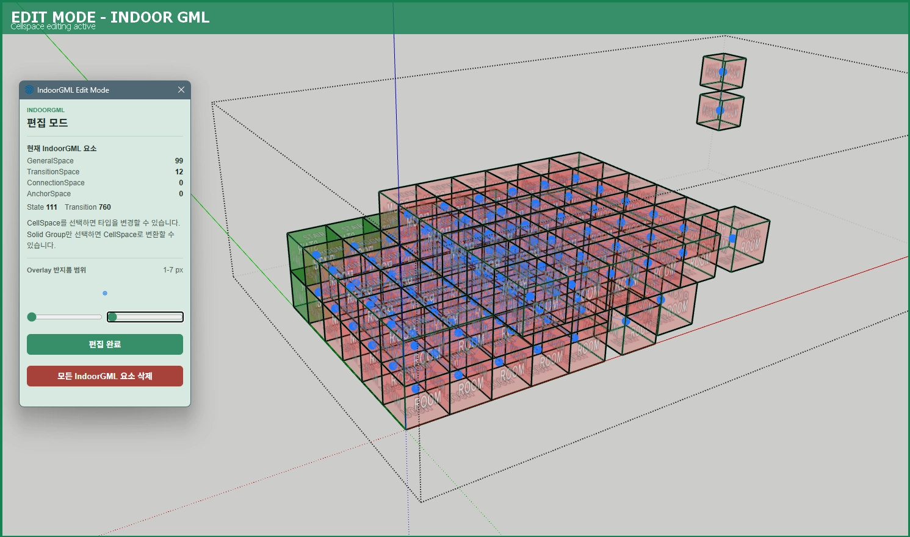
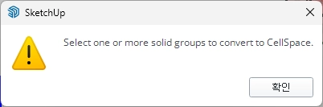
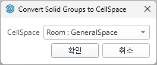
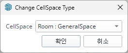
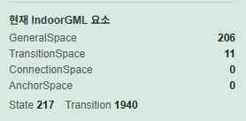
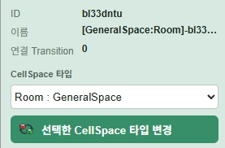

# IndoorGML 3D Modeler

> SketchUp 2026에서 solid group을 IndoorGML CellSpace로 변환하고, dual graph를 편집·검증·Export하는 Ruby Extension입니다.




## Overview

IndoorGML 3D Modeler는 SketchUp 모델 안의 manifold solid group을 IndoorGML `CellSpace` 런타임 객체로 관리하고, 인접한 CellSpace 사이의 `State`/`Transition` dual graph를 자동으로 동기화합니다.

주요 목표는 다음과 같습니다.

- SketchUp group 기반 3D 공간을 IndoorGML 1.0 Core/Navigation XML로 Export
- CellSpace 타입, 카테고리, 층 정보를 Edit Mode에서 편집
- State/Transition을 SketchUp geometry가 아닌 Overlay로 표시
- `.skp` 저장 후 다시 열어도 CellSpace runtime을 attribute에서 복원
- val3dity v2.2.0과 Extension 재검사 정책으로 Geometry/Topology 오류 확인
- 빠른 검사와 Local Vertex Normalization 기반 정밀검사 제공

## v1.0.5 Highlights

v1.0.5는 검사 자체뿐 아니라 오류를 찾고, 안전하게 보정하고, 다시 확인하는 전체 Validation 워크플로를 확장합니다.

- `Check Validity` 실행 시 **빠른 검사**와 **정밀검사** 중 선택
- 정밀검사 전 CellSpace별 **Local Vertex Normalization(LVN)** 수행
- LVN 실패 시 해당 CellSpace만 원복하고 이미 성공한 CellSpace 결과는 유지
- 이미 정규화된 CellSpace와 이전 실패 CellSpace를 구분하여 불필요한 반복 처리 방지
- Validation report의 오류 geometry를 viewport Overlay로 표시하고 오류 범위에 focus
- 빠른 검사의 701/704 재검사를 현재 SketchUp 원본 CellSpace geometry 기준으로 수행
- 선택한 CellSpace의 IndoorGML 의미만 제거하여 일반 Solid Group으로 복원
- Validation 진행률, LVN 통계, 재실행 session 정리, Fix Mode와 runtime 복원 안정성 개선

정밀검사는 geometry를 실제로 변경할 수 있는 Beta 기능입니다. CellSpace별 독립 작업과 rollback을 사용하므로 하나의 특수 형상에서 실패하더라도 다른 성공 결과를 함께 폐기하지 않습니다.

## Project Scope

이 프로젝트는 연구보고서와 legacy extension이 목표로 했던 전체 기능을 모두 복원하지 않습니다. 대신 실제 작업 경로인 **CellSpace → State → Transition → Validation → Export** 흐름에 집중합니다.

### 지원

- Solid 기반 3D CellSpace 생성
- `GeneralSpace`, `TransitionSpace`, `ConnectionSpace`, `AnchorSpace`, `CellSpace`
- `Room`, `Door`, `Stair`, `Elevator`, `ExteriorDoor`, `Window` 분류
- CellSpace별 State 생성
- 인접 CellSpace 간 Transition 자동 생성
- `.skp` 저장 후 재오픈 시 IndoorGML 정보 복원
- Edit Mode, visibility filter, geometry toggle, State/Transition Overlay
- 선택 CellSpace의 IndoorGML 속성 제거 및 일반 Solid Group 복원
- 빠른 검사와 LVN 기반 정밀검사
- Validation report, 오류 geometry Overlay, focus, Fix Mode
- val3dity 기반 Validation과 GML Export

### 미지원

- IndoorGML Import
- POI 입력·편집·Export
- `CellSpaceBoundary`, `NavigableBoundary`
- Multi-Layer와 `InterLayerConnection`
- `Route`, `RouteNode`, `RouteSegment`
- legacy AnchorNode 방식의 외부 지도 좌표계 연계
- Transition 방향, 접근 조건, 사용자 지정 통행 비용
- IndoorGML 1.0.3 전체 Conformance Class

## Version Policy

코드에서는 확장 패키지, 저장 포맷, OGC XML schema 버전을 분리합니다.

| 항목 | 값 | 정의 |
| --- | --- | --- |
| Extension/storage version | `1.0.3` | `Definition::INDOOR_GML_VERSION` |
| Extension package version | `1.0.5` | `Indoor3DGmlModeler::EXTENSION_VERSION` |
| IndoorGML XML schema version | `1.0` | `Definition::INDOOR_GML_SCHEMA_VERSION` |
| Validator runtime | `val3dity-windows-x64-v2.2.0` | `Val3dityRunner::VENDOR_ROOT` |

`schemas.opengis.net/indoorgml/1.0.3/*.xsd`는 존재하지 않으므로 Export XML의 namespace와 `xsi:schemaLocation`은 공식 IndoorGML 1.0 schema 경로를 사용합니다. SketchUp attribute에 기록되는 extension/storage version은 `1.0.3`입니다.

## Validation Contract

Validation은 XML well-formedness 확인과 val3dity 2.2.0 검사를 수행합니다. XSD validation은 수행하지 않습니다. 모든 val3dity 실행에는 GML 좌표 단위 기준 `--planarity_d2p_tol 0.025`가 적용됩니다.

검사 profile에 따라 pipeline이 달라집니다.

| Profile | Geometry 변경 | val3dity overlap 설정 | Extension 701/704 재검사 |
| --- | --- | --- | --- |
| 빠른 검사 | 없음 | `--overlap_tol -1` | 수행 |
| 정밀검사 | LVN으로 변경 가능 | 0.01 mm를 GML 좌표 단위로 변환 | 수행하지 않음 |

최종 결과는 일관되게 다음 세 상태로 보고합니다.

- `Valid`: 검사 기준에서 오류가 발견되지 않음
- `Invalid`: 수정이 필요한 Validation 오류가 있음
- `Failed`: 검사 실행 또는 후처리 자체가 완료되지 못함

Exporter는 하나의 exterior shell과 0개 이상의 `gml:interior` shell을 가진 `gml:Solid`를 생성합니다. 따라서 외부 shell 안에 완전히 포함된 cavity는 export할 수 있습니다. 서로 분리된 복수 exterior solid와 cavity 내부에 다시 solid가 중첩된 형상은 단일 CellSpace로 export하기 전에 거부됩니다.

Transition geometry는 두 State endpoint를 연결하는 방식이 기본값입니다. API 호출에서는 비교·실험 목적으로 `transition_geometry_mode: :shared_face_waypoint`를 지정하여 `State1 → shared-face waypoint → State2`의 3점 LineString을 사용할 수 있지만 기본 Export 동작은 변경되지 않습니다.

## Installation

### RBZ 설치

1. [Releases](https://github.com/UlolSkpProject/IndoorGML_3DSpace_Modeler/releases)에서 `IndoorGML_3D_Modeler-x.x.x.rbz`를 내려받습니다.
2. SketchUp 2026에서 `Extension Manager`를 엽니다.
3. `Install Extension`으로 `.rbz`를 선택합니다.
4. SketchUp을 재시작합니다.

### 개발용 직접 배치

SketchUp plugin 경로에 다음 구조로 배치합니다.

```text
Plugins/
├── indoor3d.rb
└── indoor3d/
```

현재 진입 파일은 [indoor3d.rb](indoor3d.rb)이고, 실제 extension loader는 [indoor3d/core.rb](indoor3d/core.rb)를 로드합니다.

## Quick Start

### 1. Solid Group 준비

SketchUp에서 CellSpace로 변환할 공간을 solid group 또는 component instance로 모델링합니다. 변환 대상은 manifold solid여야 하며, 하나의 CellSpace는 하나의 연결된 exterior shell이어야 합니다.



### 2. CellSpace 생성

변환할 group을 선택한 뒤 `Create CellSpace`를 실행합니다.



변환된 객체는 `IndoorGML_PrimalSpaceFeatures` group 아래로 이동되며, 대응되는 `State`가 1:1로 생성됩니다. 선택 객체가 이미 CellSpace이면 재변환하지 않습니다.

여러 group을 한 번에 선택하면 변환 가능한 항목은 계속 처리하고, 조건을 만족하지 못한 항목은 결과의 `Failed` 목록에 group 이름 또는 entity id와 함께 표시합니다.

### 3. Edit Mode 진입

`Edit CellSpace Property`를 실행하면 Edit Mode가 켜지고, CellSpace 편집 dialog와 viewport Overlay가 활성화됩니다.


Edit Mode에서는 CellSpace 이동, 타입 변경, 층 변경, visibility filter, geometry 표시 토글, State/Transition Overlay 확인을 수행합니다.

### 4. CellSpace 편집

CellSpace를 이동하거나 타입·층 정보를 변경하면 runtime attribute와 topology가 갱신됩니다. 인접 관계가 생기거나 사라지면 Transition도 자동 생성·삭제됩니다.



### 5. Validity Check

`Check Validity`를 실행하고 검사 profile을 선택합니다.

- **빠른 검사**: 현재 geometry를 바꾸지 않고 val3dity와 Extension 701/704 재검사를 수행
- **정밀검사**: CellSpace별 LVN 후 물리 허용오차 0.01 mm를 적용해 val3dity 검사

오류가 있으면 report에서 대상 CellSpace와 오류 geometry를 확인하고 Fix Mode로 수정합니다. 부분 재검사를 통과했더라도 최종 납품 전에는 전체 검사를 다시 실행해야 합니다.

### 6. Export

`Export GML`은 현재 모델을 `.gml`로 저장합니다. Export 자체가 Validation을 자동 수행하지 않으므로 권장 순서는 **전체 Validity Check → 오류 수정 → 전체 재검사 → Export GML**입니다.

## Toolbar Commands

| Command | Icon | 동작 |
| --- | --- | --- |
| Create CellSpace |  | 선택한 solid group을 CellSpace로 변환 |
| Edit CellSpace Property |  | Edit Mode 시작/종료 |
| Change CellSpace Type |  | 선택한 CellSpace 타입/카테고리 변경 |
| Show/Hide Geometry |  | CellSpace geometry 표시 토글 |
| Show/Hide State/Link Overlay |  | State/Transition Overlay 표시 토글 |
| Dual Overlay Scale |  | State 표시 크기 조절 |
| Export GML |  | IndoorGML 1.0 GML 파일 저장 |
| Check Validity |  | 검사 profile 선택 후 Validation 실행 |

Context menu는 상황에 따라 `Edit IndoorGML`, `Change CellSpace Type` 등 IndoorGML 편집 항목을 추가합니다.

## CellSpace Types

현재 선택 가능한 CellSpace 타입과 기본 카테고리는 다음과 같습니다.

| CellSpace type | Category | Export tag |
| --- | --- | --- |
| `GeneralSpace` | `Room` | `navi:GeneralSpace` |
| `TransitionSpace` | `Stair` | `navi:TransitionSpace` |
| `TransitionSpace` | `Elevator` | `navi:TransitionSpace` |
| `ConnectionSpace` | `Door` | `navi:ConnectionSpace` |
| `AnchorSpace` | `ExteriorDoor` | `navi:AnchorSpace` |
| `CellSpace` | `Window` | `core:CellSpace` |

Navigation semantic code는 [indoor3d/domain/navigation_semantic.rb](indoor3d/domain/navigation_semantic.rb)에 정의되어 있으며, 기본값은 IndoorGML Annex D code space를 사용합니다. CellSpace attribute에 navigation semantic override 값이 있으면 Export 시 override가 우선합니다.

## Tag-Based Classification

일부 SketchUp tag 이름은 CellSpace 타입과 카테고리로 자동 매핑됩니다.

| Tag suffix | CellSpace |
| --- | --- |
| `MV_RM_01` | `TransitionSpace / Elevator` |
| `MV_RM_02` | `TransitionSpace / Stair` |
| `IP_RM_05` | `TransitionSpace / Stair` |
| `IP_RM_23` | `GeneralSpace / Room` |
| `RM_DR` | `ConnectionSpace / Door` |
| `RM_WD` | `CellSpace / Window` |

Tag 이름 앞부분은 `F01F02_` 또는 `B01F01_` 같은 층 패턴이어야 합니다. 예를 들어 `F01F02_MV_RM_02`는 `TransitionSpace / Stair`로 해석됩니다. Tag로 타입이 결정된 선택 항목은 Edit Mode dialog에서 classification이 잠길 수 있습니다.

CellSpace 생성 시 층 정보 우선순위는 다음과 같습니다.

**직접 지정된 TAG → 상위 컨테이너에서 전달된 TAG → dialog에서 선택한 층 → 기본층**

유효한 직접 TAG나 상위 container TAG의 층 정보는 dialog 선택값보다 우선합니다.

## Storey

CellSpace는 `storey` attribute를 가집니다. 기본값은 `F01`입니다.

지원 형식:

- `F01`, `F02`, ... `F99`
- `B01`, `B02`, ... `B99`
- `F01~F03` 같은 range

층 range 편집은 `TransitionSpace` 중 `Stair`, `Elevator` 카테고리에 허용됩니다. 일반 CellSpace는 첫 번째 층 값만 저장합니다.

Edit Mode dialog는 Storey filter와 Type filter를 제공하여 특정 층 또는 타입만 표시할 수 있습니다.





## Edit Mode Behavior

Edit Mode는 SketchUp scene 상태를 보호하면서 IndoorGML 편집을 수행하기 위한 작업 모드입니다.

주요 동작:

- `IndoorGML_PrimalSpaceFeatures`와 CellSpace lock 상태를 편집 상태에 맞게 조정
- 선택 변경을 감지하여 dialog snapshot 갱신
- CellSpace type/category/storey 변경
- Solid group 선택 시 dialog에서 CellSpace 변환
- Storey/Type visibility filter 적용
- State/Transition Overlay invalidation
- 선택 CellSpace의 IndoorGML 속성 제거
- 모든 IndoorGML 요소 삭제
- Validation report에서 오류 CellSpace와 오류 geometry focus
- 오류 요소 재검사와 Fix Mode 진입

Edit Mode dialog의 `편집 완료`는 Edit Mode를 종료하고, 필요한 runtime·topology·Overlay 상태를 정리합니다.

### 선택 CellSpace를 일반 Solid Group으로 복원

선택한 CellSpace에서 IndoorGML 의미를 제거하면 다음 항목이 정리됩니다.

- CellSpace runtime 등록과 IndoorGML attribute dictionary
- 연결된 State와 Transition
- adjacency 정보
- CellSpace material
- observer 및 runtime tracking 정보

원래 SketchUp group geometry와 group에 지정된 TAG는 유지됩니다. 여러 CellSpace는 하나의 batch로 처리하며, 처리 중 오류가 발생하면 runtime snapshot을 원복합니다.

## Topology and Transition Policy

CellSpace 인접 관계는 `AdjacencyService`가 동기화합니다.

현재 Transition 생성 정책:

- 두 CellSpace가 모두 valid여야 합니다.
- 두 CellSpace 모두 valid dual State를 가져야 합니다.
- geometry adjacency detector가 인접 축을 찾으면 Transition을 허용합니다.
- CellSpace 타입 또는 `x/y/z` 방향에 따른 추가 차단 정책은 현재 없습니다.

즉, 현재 정책은 `transition_allowed_for_axis?(adjacency_axis)`가 `nil`이 아닌 축을 받으면 Transition을 생성하는 구조입니다. 이 정책은 [docs/architecture_decisions.md](docs/architecture_decisions.md)에 명시되어 있습니다.

Window는 NavigableSpace가 아닌 CellSpace로, State는 생성되지만 Transition은 생기지 않습니다.

성능 관련 구현:

- CellSpace별 incremental sync
- dirty queue와 `UI.start_timer`를 사용한 지연 topology sync
- bounding box 후보 필터
- face-level adjacency 검사
- batch lifecycle에서 전체 sync와 부분 refresh 분리
- 전체 동기화 시 큰 pair set의 worker thread 처리

## Persistence

IndoorGML runtime 데이터는 SketchUp attribute dictionary `IndoorGml`에 저장됩니다.

주요 저장 값:

- `feature`
- `name`
- `indoor_gml_version`
- `id`
- `cell_type`
- `category_code`
- `storey`
- `duality_state_id`
- navigation semantic override fields
- LVN 완료 또는 이전 실패 상태

파일을 다시 열면 `RuntimeRestorer`가 PrimalGroup 아래의 CellSpace attribute를 읽어 `CellSpace`와 `State`를 복원합니다. Transition은 저장된 선형 geometry가 아니라 CellSpace adjacency를 다시 계산해 runtime에서 재구성합니다.

재사용된 SketchUp model 객체가 다시 활성화되는 경우에도 runtime과 ModelObserver lifecycle을 다시 결합하고, 이전 Validation session과 timer가 새 모델에 영향을 주지 않도록 정리합니다.

## Export

Exporter는 현재 SketchUp 모델을 root context 기준으로 정규화한 뒤 `ExportSnapshot`을 만들고, `GmlWriter`가 IndoorGML XML을 생성합니다.

Export 구조:

- root: `core:IndoorFeatures`
- `core:primalSpaceFeatures`
- `core:PrimalSpaceFeatures`
- `core:cellSpaceMember`
- `core:multiLayeredGraph`
- 단일 `core:SpaceLayer` (`IS1`)
- `core:nodes` 아래 `core:State`
- `core:edges` 아래 `core:Transition`

GML 좌표:

- SketchUp 내부 좌표는 inch입니다.
- Export 시 모델의 `UnitsOptions/LengthUnit`에 따라 `in`, `ft`, `mm`, `cm`, `m` 중 하나로 변환합니다.
- `gml:Point`, `gml:LineString`, `gml:Solid`, `gml:Polygon`에는 `srsName`, `srsDimension`, `axisLabels`, `uomLabels`를 기록합니다.

지원하지 않는 IndoorGML 요소:

| 요소 | 상태 |
| --- | --- |
| 다중 `SpaceLayer` | 미지원, 단일 `IS1`만 생성 |
| `CellSpaceBoundary` | 미출력 |
| `NavigableBoundary` | 미출력 |
| `InterLayerConnection` | 미출력 |
| `Route`, `RouteNode`, `RouteSegment` | 미지원 |
| POI | application-specific 후보, 현재 Export 제외 |
| legacy AnchorNode | application-specific 후보, 현재 Export 제외 |

## Validity Check

`Check Validity`를 실행하면 빠른 검사와 정밀검사 선택 dialog가 표시됩니다. 두 profile은 동일한 진행 dialog, 종료 코드 판정, report, 오류 focus, Fix Mode를 사용하지만 geometry 처리와 overlap 판정 경로가 다릅니다.

### 빠른 검사

현재 CellSpace geometry를 변경하지 않는 기본 검사입니다.

1. Edit Mode와 이전 완료 Validation session 정리
2. isolated validation workspace와 임시 `input.gml` 생성
3. val3dity 2.2.0 실행
   - `--overlap_tol -1`
   - `--planarity_d2p_tol 0.025`
4. report의 701/704 오류 대상 ID를 현재 SketchUp CellSpace와 연결
5. 현재 모델의 원본 face/boundary를 분석하고 필요한 Boolean만 독립 복제본에서 수행
6. 최종 JSON과 HTML report 생성

빠른 재검사는 비솔리드 교차 결과, edge-only 접촉, 허용오차 경계의 접촉을 구분하며 파괴적인 Boolean 실패가 원본 CellSpace를 변경하지 않도록 합니다.

### 정밀검사

val3dity 실행 전에 CellSpace geometry를 정규화하는 Beta 검사입니다.

1. 각 CellSpace를 definition-local 좌표계에서 Local Vertex Normalize
2. 성공한 CellSpace geometry 유지
3. 실패한 CellSpace만 원복하고 `lvn_failed` 상태 기록
4. 임시 GML 생성
5. val3dity 2.2.0 실행
   - 물리 허용오차 0.01 mm를 현재 GML 좌표 단위로 변환하여 `--overlap_tol`에 전달
   - `--planarity_d2p_tol 0.025`
6. 최종 JSON과 HTML report 생성

정밀검사에서는 Extension의 별도 701/704 재검사를 수행하지 않습니다.

### Local Vertex Normalization

LVN은 기존 정점을 단순 이동하는 대신 solid shell을 다시 구성하여 정점 병합 과정에서 GML ring이나 triangle topology가 손상되는 문제를 줄입니다.

주요 처리:

- 기본 0.001 mm 단위 정점 정규화
- coplanar face와 shared edge 정리
- 공선 정점과 축소된 sliver triangle 복구
- 수평면과 공유 Edge 높이 정렬
- triangle intersection과 patch 재구성
- 정규화 후 manifold solid와 topology 재검증

CellSpace별 독립 작업 원칙:

- 하나의 CellSpace 실패는 해당 CellSpace에만 rollback
- 다른 CellSpace의 성공 결과는 유지
- 이미 정규화된 CellSpace는 반복 처리 생략
- 이전 실패 CellSpace는 geometry가 변경되기 전까지 재시도 생략
- geometry 수정 시 실패 상태를 해제하여 재시도 가능
- 성공한 CellSpace가 있을 때만 필요한 topology 동기화 수행

완료 화면은 `성공`, `기존 완료`, `실패`, `이전 실패 생략`을 구분하여 표시합니다.

### Report, 오류 Overlay와 Fix Mode

Validation report에서 오류 행을 선택하면 관련 CellSpace와 오류 geometry를 viewport에서 함께 확인할 수 있습니다.

- report ID와 현재 runtime CellSpace 매핑
- 오류 geometry Overlay 표시
- horizontal OBB 기반 focus 범위 계산
- visibility 반영 후 upright isometric camera와 zoom extents 적용
- report와 Fix Mode 사이의 선택·focus 상태 유지
- PrimalSpaceFeatures 직접 자식 group 편집 지원
- 오류 요소만 다시 검사하는 부분 재검사 지원

부분 재검사 통과는 전체 모델의 최종 유효성을 의미하지 않습니다. 수정 완료 후 전체 `Check Validity`를 다시 실행해야 합니다.

### Validation 실행 중 동작

Validation 실행 중에도 다음 표시 기능을 사용할 수 있습니다.

- CellSpace geometry 표시/숨김
- State/Transition Overlay 표시/숨김
- State/Link Overlay Scale 변경

val3dity process가 실행되는 동안 `IndoorGML_PrimalSpaceFeatures`는 잠가 geometry가 동시에 변경되지 않도록 합니다. 취소 버튼은 실제 process를 중단할 수 있는 구간에서만 활성화됩니다.

완료 dialog나 report가 열린 상태에서 검사를 다시 실행하면 이전 session을 먼저 정리한 뒤 새 검사를 시작합니다.

> bundled val3dity runtime은 Windows x64용입니다. 현재 자동 Validity Check는 Windows에서만 지원됩니다.

## Legacy and Stabilization Notes

현재 프로젝트는 legacy `une-young/indoorgml-modeler`의 모든 UI 기능을 복구한 것이 아니라, 저장·복원, topology, Export, Validation을 실제 사용 가능한 흐름으로 재작성한 버전입니다.

| 영역 | Legacy 또는 이전 구현의 문제 | 현재 처리 |
| --- | --- | --- |
| 저장·복원 | SketchUp 재오픈 후 runtime 정보가 사라질 수 있음 | Attribute dictionary 기반 복원 |
| State 중복 | 같은 entity 재변환 시 State 중복 가능 | 이미 변환된 CellSpace 검사 |
| Node/Link 표시 | 보조선·geometry 기반 표시로 모델 오염 가능 | 3D Overlay로 분리 표시 |
| Transition 중복 | 같은 CellSpace pair에 중복 Transition 가능 | pair key 기준 단일 Transition 관리 |
| Duality/Connects | 끊어진 참조가 Export에 남을 수 있음 | Export snapshot에서 유효 관계만 작성 |
| GML 생성 | 외부 converter 내부 구조 확인 어려움 | Ruby exporter로 Core/Navigation subset 직접 생성 |
| Validation | report만으로 오류 위치 추적이 어려움 | report ID와 오류 geometry를 viewport focus로 연결 |
| Geometry 보정 | 한 형상 실패가 전체 보정 결과를 무효화할 수 있음 | CellSpace별 LVN operation과 개별 rollback |
| 701/704 재검사 | export GML 재구성 geometry와 현재 모델 불일치 가능 | 현재 SketchUp 원본 geometry 분석, Boolean만 clone 사용 |

최근 안정화 작업:

- Bulk 변환에서 개별 항목 실패를 전체 rollback 대신 실패 목록으로 보고
- Undo/Redo 이후 runtime reconciliation 수행
- Validation 실행별 isolated workspace 사용
- val3dity process 종료를 stdout EOF가 아닌 process handle/exit code로 판정
- 모델 New/Open/Close 시 stale Validation callback 정리
- Windows process handle 상속을 stdout/stderr pipe로 제한
- Validation 재실행 전 이전 dialog/report/session 정리
- CellSpace 생성·타입 변경·속성 제거 후 topology와 Overlay refresh 범위 최적화
- LVN 실패 CellSpace만 원복하고 성공 CellSpace 결과 유지

## Architecture

```text
indoor3d/
├── definition.rb                  # version constants
├── core.rb                        # extension runtime loader
├── domain/                        # CellSpace, State, Transition, semantics
├── application/
│   ├── adjacency_service/         # adjacency sync and geometry query
│   ├── indoor_model/              # IndoorModel mixins and lifecycle
│   ├── local_vertex_normalizer/   # CellSpace-local geometry normalization
│   └── precision_validation/      # Fast/Precision validation integration
├── infrastructure/
│   ├── observers/                 # SketchUp observer adapters
│   ├── persistence/               # AttributeSerializer, RuntimeRestorer
│   └── scene/                     # active path, locks, editor session
├── export/                        # snapshot, exporter, XML writer
├── validity/                      # val3dity runner, report, recheck policy
├── ui/                            # commands, dialogs, Overlay
└── utils/                         # geometry, transform, materials
```

`IndoorModel`은 다음 mixin으로 나뉩니다.

| Mixin | 책임 |
| --- | --- |
| `RuntimeSupport` | runtime collection, registry binding, attribute helper |
| `SceneGroups` | PrimalGroup 생성/보호, 좌표 변환, scene 배치 |
| `FeatureLifecycle` | CellSpace 생성/변경/삭제 lifecycle |
| `CellSpaceDemotionBatch` | 선택 CellSpace의 IndoorGML 의미 제거와 rollback |
| `Topology` | adjacency와 Transition runtime sync |
| `ObserverRouting` | SketchUp observer event 라우팅 |
| `EntityRelocation` | entity 복제/이동과 transform 보존 |
| `PrimalNormalization` | PrimalGroup child 정규화 |
| `EditorControl` | Edit Mode action과 Validation focus 제어 |

## Development

### Test

```powershell
ruby -Itest test\run_all.rb
```

테스트는 SketchUp API를 직접 실행하지 않는 domain, geometry, serialization, validation policy와 integration contract를 중심으로 구성되어 있습니다. 기능 변경 후에는 전체 테스트와 관련 smoke/recheck를 함께 실행합니다.

### Useful Checks

```powershell
# Ruby syntax check
Get-ChildItem -Recurse -Filter *.rb indoor3d,test | ForEach-Object { ruby -c $_.FullName }

# 전체 테스트
ruby -Itest test\run_all.rb
```

## Known Limitations

- Validation은 bundled Windows x64 val3dity runtime에 의존합니다.
- 정밀검사는 Beta 기능이며 geometry를 변경할 수 있고 모델 규모에 따라 수십 분에서 수시간이 걸릴 수 있습니다.
- 정밀검사에서 이전 실패로 표시된 CellSpace는 geometry가 수정되기 전까지 LVN 재시도를 생략합니다.
- Export는 IndoorGML 1.0 Core/Navigation의 단일 SpaceLayer 모델만 생성합니다.
- Transition 생성 정책은 현재 CellSpace 타입과 수직/수평 방향을 구분하지 않습니다.
- State/Transition을 사용자가 직접 생성·연결·해제하는 topology editor는 없습니다.
- Undo/Redo는 runtime reconciliation이 있지만 SketchUp `active_path`, observer callback, transparent operation이 얽히는 경우 대형 모델에서 재동기화 비용이 발생할 수 있습니다.
- Edit Mode 밖에서 `IndoorGML_PrimalSpaceFeatures`나 CellSpace group을 직접 이동·삭제하면 runtime과 저장 attribute가 일시적으로 어긋날 수 있습니다. 가능한 한 Edit Mode와 제공 명령으로 수정하세요.

## References

- [v1.0.5 Release Notes](https://github.com/UlolSkpProject/IndoorGML_3DSpace_Modeler/releases/tag/v1.0.5)
- [IndoorGML](https://www.ogc.org/standards/indoorgml)
- [IndoorGML 1.0 schemas](http://schemas.opengis.net/indoorgml/1.0/)
- [val3dity](https://github.com/tudelft3d/val3dity)
- [Legacy reference](https://github.com/une-young/indoorgml-modeler)
- [Project notes](https://u-lo-l.notion.site/IndoorGML-3DSpace-Modeler-395be883973b805dba28c890c9c7e225)
